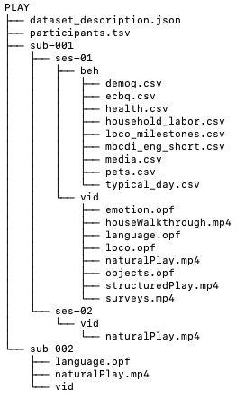

# Adapting BIDS to Databrary 2.0

The [Brain Imaging Data Structure (BIDS)](https://bids-specification.readthedocs.io/en/stable/) can be adapted for use on Databrary.
It realizes a participant/session/measure hierarchy.

- [Here](db2-bids/PLAY/dataset_description.json) is a sample JSON file that describes the dataset in the BIDS `dataset_description.json` format.
- [Here](db2-bids/PLAY/participants.tsv) is a tab-separated text file with the minimal required data for a `participant.tsv` file.

## Sample BIDS-style hierarchy for PLAY

`tree db2-bids/PLAY` yields the following:

The [Hierarchical Event Descriptors](https://www.hedtags.org/) might be adapted for use with Datavyu files.

